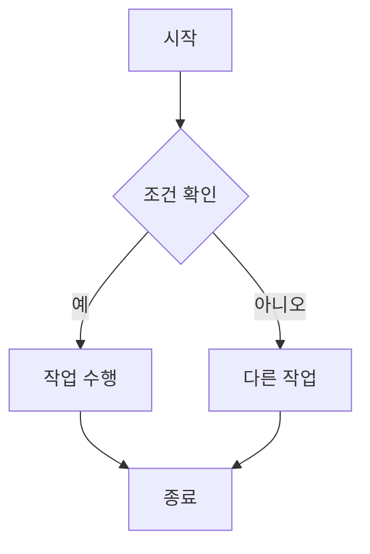
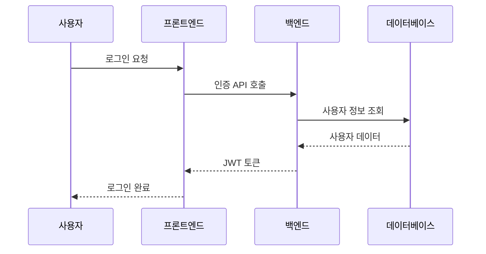
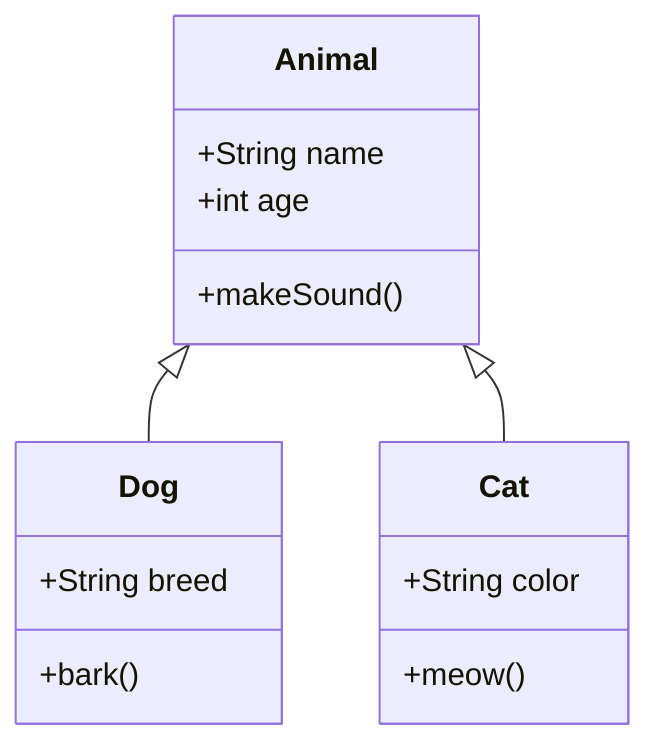
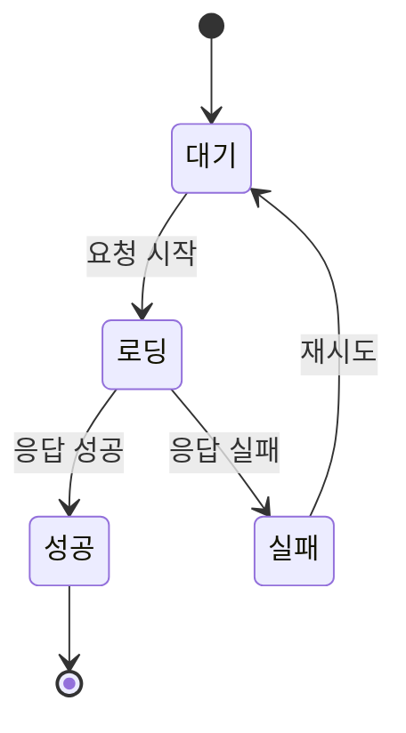
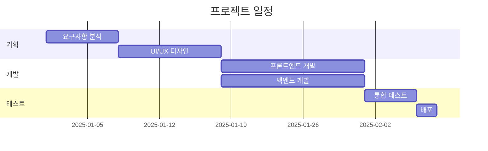
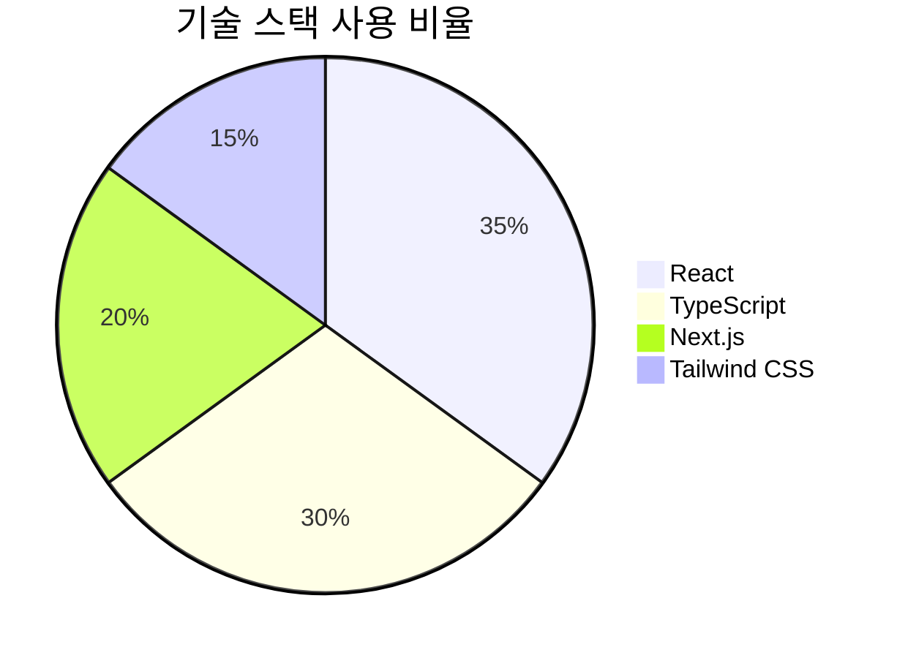
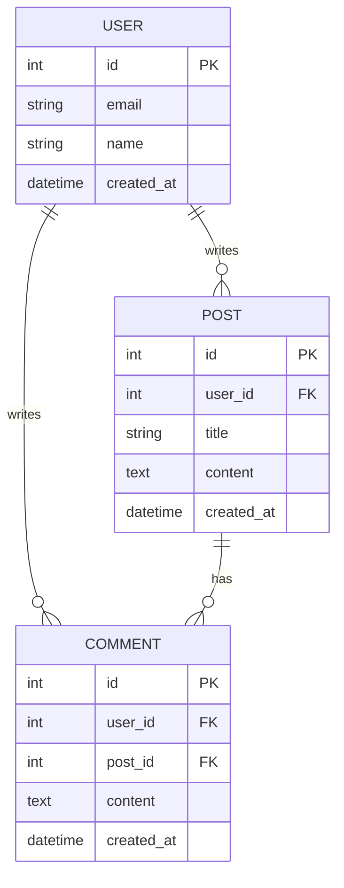

# 글 제목

글의 도입부를 작성하세요. 이 글에서 다룰 내용을 `간단히` 소개합니다.

---

## 📚 카테고리별 글 작성 가이드

### 🖥️ Tech 카테고리
**기술 튜토리얼, 프레임워크/라이브러리 사용법, 개발 도구 소개**

```yaml
category: 'Tech'
```

**예시 구조:**
1. **문제 상황**: 해결하고자 하는 기술적 문제
2. **해결 방법**: 단계별 구현 및 코드 예제
3. **결과 및 팁**: 실행 결과, 주의사항, 최적화 팁

```typescript
// Tech 글에 적합한 코드 예제
interface UserProps {
  id: string;
  name: string;
  email: string;
}

const UserCard = ({ id, name, email }: UserProps) => {
  return (
    <div className="user-card">
      <h3>{name}</h3>
      <p>{email}</p>
    </div>
  );
};
```

---

### 💻 CS 카테고리
**컴퓨터 과학 이론, 알고리즘, 자료구조, 운영체제, 네트워크**

```yaml
category: 'CS'
```

**예시 구조:**
1. **개념 설명**: 핵심 개념 정의 및 배경
2. **원리 분석**: 동작 원리, 시간/공간 복잡도
3. **구현 예제**: 실제 코드로 구현
4. **활용 사례**: 실무에서의 활용

```python
# CS 글에 적합한 알고리즘 예제
def binary_search(arr, target):
    """
    이진 탐색 알고리즘
    시간 복잡도: O(log n)
    """
    left, right = 0, len(arr) - 1

    while left <= right:
        mid = (left + right) // 2
        if arr[mid] == target:
            return mid
        elif arr[mid] < target:
            left = mid + 1
        else:
            right = mid - 1

    return -1  # 찾지 못한 경우
```

---

### 📝 Log 카테고리
**개발 일지, 트러블슈팅, 프로젝트 회고, 학습 기록**

```yaml
category: 'Log'
```

**예시 구조:**
1. **상황**: 어떤 작업을 하고 있었는지
2. **문제 발생**: 발생한 문제와 에러 메시지
3. **해결 과정**: 시도한 방법들과 실패/성공 경험
4. **배운 점**: 얻은 인사이트와 앞으로의 계획

```bash
# Log 글에 적합한 트러블슈팅 예제

# 문제 상황
$ npm run build
Error: Cannot find module 'next/dist/compiled/webpack/webpack'

# 시도 1: node_modules 삭제 후 재설치
$ rm -rf node_modules package-lock.json
$ npm install
# 결과: 실패

# 시도 2: Next.js 버전 업데이트
$ npm install next@latest
# 결과: 성공! ✅
```

---

## 🎯 마크다운 문법 가이드

### 헤딩 (제목)

```markdown
# H1 - 메인 제목
## H2 - 대주제
### H3 - 소주제
#### H4 - 세부 항목
```

### 텍스트 강조

**굵게**, *기울임*, ~~취소선~~, `인라인 코드`

### 리스트

**순서 없는 리스트:**
- 항목 1
- 항목 2
  - 하위 항목 2-1
  - 하위 항목 2-2

**순서 있는 리스트:**
1. 첫 번째
2. 두 번째
3. 세 번째

### 코드 블록

**JavaScript:**
```javascript
function greet(name) {
  return `Hello, ${name}!`;
}

console.log(greet('World'));
```

**TypeScript:**
```typescript
interface User {
  id: number;
  name: string;
  email: string;
}

const user: User = {
  id: 1,
  name: 'John Doe',
  email: 'john@example.com',
};
```

**Python:**
```python
def greet(name):
    return f"Hello, {name}!"

print(greet("World"))
```

### 인용문

> 중요한 내용이나 인용문은 이렇게 표시할 수 있습니다.
>
> 여러 줄로 작성할 수도 있습니다.

### 링크와 이미지

**링크:**
[Next.js 공식 문서](https://nextjs.org)

**이미지:**

이미지는 `public` 폴더에 저장하고 `/` 경로로 참조합니다.

```markdown

```

**이미지 파일 구조 권장사항:**
```
public/
├── images/
│   ├── tech/          # Tech 카테고리 이미지
│   ├── cs/            # CS 카테고리 이미지
│   └── log/           # Log 카테고리 이미지
└── testimg.svg        # 루트 레벨 이미지
```

**사용 예시:**
- `public/testimg.svg` → ``
- `public/images/tech/react-diagram.png` → ``

### 표 (GFM)

| 항목   | 설명   | 상태 |
| ------ | ------ | ---- |
| 기능 1 | 설명 1 | ✅   |
| 기능 2 | 설명 2 | 🚧   |
| 기능 3 | 설명 3 | ❌   |

**정렬된 표:**

| 왼쪽 정렬 | 가운데 정렬 | 오른쪽 정렬 |
| :-------- | :---------: | ----------: |
| Left      |   Center    |       Right |

### 체크박스 (GFM)

- [x] 완료된 작업
- [x] 완료된 또 다른 작업
- [ ] 진행 중인 작업
- [ ] 아직 시작하지 않은 작업

**중첩 체크박스:**
- [x] 주요 작업 1
  - [x] 하위 작업 1-1
  - [x] 하위 작업 1-2
- [ ] 주요 작업 2
  - [x] 하위 작업 2-1
  - [ ] 하위 작업 2-2

### 자동 링크 (GFM)

웹사이트 URL을 그대로 입력하면 자동으로 링크가 됩니다:
- https://github.com
- https://nextjs.org
- https://react.dev

이메일도 자동으로 링크됩니다:
- example@email.com

---

## 📊 Mermaid 다이어그램

### 플로우차트



### 시퀀스 다이어그램



### 클래스 다이어그램



### 상태 다이어그램



### 간트 차트



### 파이 차트



### ER 다이어그램



---

## 💡 글 작성 팁

### 1. 명확한 제목
- 구체적이고 검색 가능한 제목 사용
- 예: "React에서 useEffect 사용법" (❌) → "React useEffect로 API 데이터 패칭 구현하기" (✅)

### 2. 코드 가독성
- 코드 블록에 언어 명시 (syntax highlighting)
- 주석으로 핵심 로직 설명
- 완전히 동작하는 예제 코드 제공

### 3. 구조화
- 헤딩으로 내용 계층 구분
- 단락은 3~4줄 이내로 유지
- 리스트와 표로 정보 정리

### 4. 시각 자료
- Mermaid 다이어그램 활용
- 스크린샷이나 GIF로 결과 보여주기
- 표로 비교 정보 정리

---

## 마무리

이 템플릿을 참고하여 카테고리에 맞는 글을 작성해보세요!

**다음 단계:**
1. `content/posts/` 폴더에 새 `.mdx` 파일 생성
2. 메타데이터(frontmatter) 작성
3. 카테고리에 맞는 구조로 본문 작성
4. 코드 예제와 다이어그램 추가
5. 로컬에서 확인 후 발행
